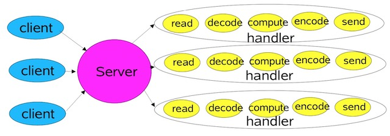
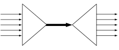
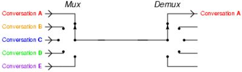
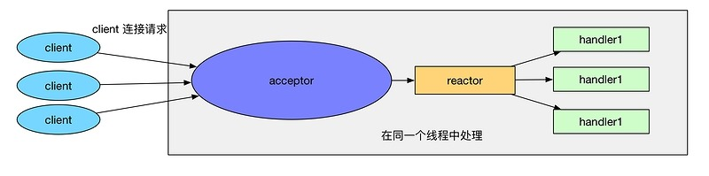
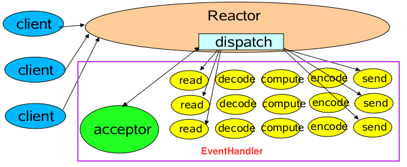
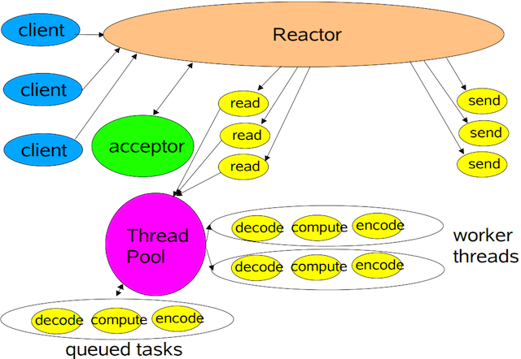
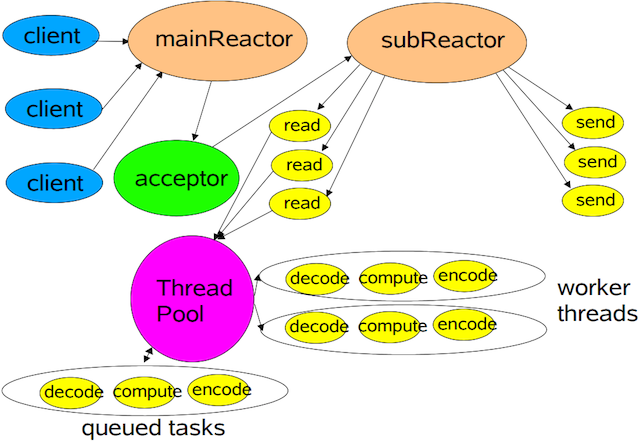

# handwriting-nio-reactor
深入了解Java网络编程中的BIO、NIO、IO多路复用（select、poll、epoll）、Reactor模式，以及零拷贝。

### BIO single thread 模式
存在三处阻塞：监听客户端连接(socket.accept)、读/写客户端数据(socket.read/socket.write)，该IO模式不支持并发连接。

### BIO multi thread 模式

+ 仍然存在三处阻塞：监听客户端连接、读/写客户端数据，只是读/写数据在新线程中处理，因此对监听客户端连接所在的主线程而言是非阻塞IO模式，可以支持并发连接。
+ 应用程序所在的`用户空间`可能存在大量闲置连接（客户端可能只是建立连接，未发送数据），无法支持百万级连接。  
+ 大量线程会造成线程上下文频繁切换（`用户空间`和`内核空间`切换），这里涉及`数据拷贝`、`CPU中断`等问题。 
+ 状态数据及其他共享数据，需要采用并发同步控制。

### NIO 模式

###### Basic NIO模式（不基于Selector）
+ 在同一个线程中接受客户端连接和处理读/写事件。
+ 将客户端与服务端建立的socket保存到List中
+ 每次循环都要遍历所有连接，有可能客户端只是建立连接，还没有进行读写，这里每次要处理大量无读写事件的连接，效率太低  

###### BIO Based Selector模式（只获取有事件的连接）  
+ 基于事件驱动 -> selector（支持对多个socketChannel的监听）。  
+ 统一的事件分派中心 -> dispatch。
+ 事件处理服务 -> read & write。
+ NIO一定程度解决了BIO的同步阻塞和连接限制问题。
+ NIO的一个重要特点：socket`读`、`写`、`注册`和`接收`函数，在等待就绪阶段都是非阻塞的，真正的I/O操作是同步阻塞的（消耗CPU但性能非常高）。  
+ 如果有大量文件描述符都要读，那么就得一个一个的read。这会带来大量的Context Switch（ read 是系统调用，每调用一次就得在用户态和核心态切换一次）。  
+ Java的NIO模式的Selector网络通讯，其实就是一个简单的Reactor模型。可以说是Reactor模型的朴素原型

### 什么是IO多路复用？

###### 解释一：一根网线，多个sock复用

###### 解释二：I/O multiplexing 这里面的 multiplexing 指的其实是在单个线程通过记录/跟踪每一个Sock(I/O流)的状态

###### 特点：
+ IO多路复用是操作系统内核提供的能力，linux由select、poll、epoll提供，windows是IOCP。  
+ IO多路复用解决了NIO对大量文件描述符读取时，需要逐个调用socket.read()造成大量上下文切换的问题。
+ IO多路复用（IO Multiplexing）机制：程序注册一组socket文件描述符给操作系统，表示“我要监视这些fd是否有IO事件发生，有了就告诉程序处理”。  
+ 在操作系统级别，NIO和IO多路复用是两个相对独立的事情，操作系统并不会强制这俩必须得一起用。IO多路复用和NIO是要配合一起使用才有实际意义。
+ NIO仅仅是指IO API总是能立刻返回，不会被Blocking；而IO多路复用仅仅是操作系统提供的一种便利的通知机制。

* * *

### Reactor是什么, 为什么要用Reactor？
+ 事件驱动（event handling）  
+ 可以处理一个或多个输入源（one or more inputs）  
+ 通过Service Handler同步的将输入事件（Event）采用多路复用分发给相应的Request Handler（多个）处理

### 单Reactor单工作线程模式（经典Reactor模式）  

    
  这是最简单的单Reactor单线程模型。Reactor线程是个多面手，负责多路分离套接字，Accept新连接，并分派请求到Handler处理器中。  
  
    
  来自于“Scalable IO in Java”，和上面的图的意思，差不多。Reactor和Hander 处于一条线程执行。  
  顺便说一下，可以将上图的acceptor，看做是一种特殊的handler。

###### Reactor模式主要包含如下角色
+ Reactor 将I/O事件发派给对应的Handler。  
+ Acceptor 处理客户端连接请求。  
+ Handlers 执行非阻塞读/写。  

### 单Reactor多工作线程模式  
  
+ 经典Reactor模式中，尽管一个线程可同时监控多个请求（Channel），但是所有读/写请求以及对新连接请求的处理都在同一个线程中处理，无法充分利用多CPU的优势。
+ 读/写操作也会阻塞对新连接请求的处理。因此可以引入多工作线程，并行处理多个读/写操作

### 多Reactor多工作线程模型
  
+ mainReactor负责监听server socket，用来处理新连接的建立，将建立的socketChannel指定注册给subReactor。
+ subReactor维护自己的selector, 基于mainReactor注册的socketChannel多路分离IO读写事件，读写网络数据，对业务处理的功能，另其扔给worker线程池来完成。
+ 每个subReactor分别属于一个独立的线程，每个成功连接后的Channel的所有操作由同一个线程处理。这样保证了同一请求的所有状态和上下文在同一个线程中，避免了不必要的上下文切换，同时也方便了监控请求响应状态。

###### 参考：
+ https://www.zhihu.com/question/32163005
+ http://www.jasongj.com/java/nio_reactor